# b2b.ai - Website

# Introduction
Portfolio Project 1 for Code Institute Full-stack development program: HTML/CSS Essentials.

This project is a Front End website for a B2B Company. The main purpose of this website is to provide expert insights into artificial intelligence, machine learning and beyond. The website is interactive and user-friendly allowing the user to interact with the company through a contact form, subscribe form and social media channels.

[Live Project Here](https://cgauci87.github.io/ci-portfolio-one-b2b.ai/)

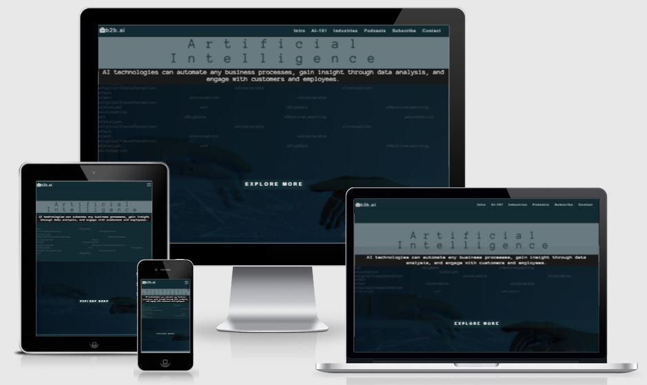

## README Table Content

* [Introduction](#introduction)
* [User Experience UX](#user-experience---UX)
    * [User stories](#user-stories)
* [Design](#Design)
        
    * [Website Structure](#website-structure)
    * [Colour Scheme](#colour-scheme)
    * [Typography](#typography)
    * [Imagery](#imagery)
    * [Audio](#audio)
    * [interactive Links](#interactive-links) 
* [Features](#features)  
    * [Intro Section](#intro)
    * [AI-101 Section](#ai-101)
    * [Industries Section](#industries)
    * [Podcasts Section](#podcasts)
    * [Subscribe Section](#subscribe)
    * [Contact Section](#contact)
    * [Footer](#footer)
    * [Submitted Form Page](#submitted-form)
* [Future Features](#future-features)
    * [Search Bar](#search-bar)
	* [Dark/Light Mode Theme Toggle](#theme-switch)
* [Technologies Used](#technologies-used)
    * [Languages Used](#languages-used)
    * [Frameworks - Libraries - Programs Used](#frameworks---libraries---programs-used)
* [Testing](#testing)
    * [Bugs](#bugs)
    * [Website Development Issues](#website-development-issues)
* [Deployment](#deployment-this-project)
    * [Deployment This Project](#deployment-this-project)
    * [Forking This Project](#forking-this-project)
    * [Cloning This Project](#cloning-this-project)
* [Credits](#credits)
* [Content](#content)

## User Experience - UX

 ### User Stories

* As a website creator, I want to:
  
1. Build a website that is visually appealing from the user’s first visit so they are keen to explore the entire site.
2. Build an easy to navigate website for its users.
   
* As a new visitor, I want to:

1. Understand the main purpose of the site.
2. Be able to easily navigate throughout the site and find relevant content about Artificial Intelligence.
3. Be able to easily contact b2b.ai for any queries.
   
* As a returning visitor, I want to:

1. Be able to find newly available articles and podcasts.
2. Be able to subscribe.
   
## Design

### Website Structure
B2b.ai website is a one page with six sections: Intro, AI-101, Industries, Podcasts, Subscribe and Contact.

#### Colour Scheme
 
 There are four main colours used: (1 ) Charleston Green #122a31 color RGB value is (18,42,49), used as a background color of the respective sections. (2) Sky Blue #7fddfc color RGB value is (127,221,252), mainly used to highlight text and also being used when the user hovers on buttons. (3) Alice Blue #ebf4f7 color RGB value is (235,244,247), used on text. (4) Black #000000 color RGB value is (0,0,0), mainly used as a background of headings. Background-blend-mode property is dominantly used to blend with each other and with the element's background color.
 
#### Typography
* Anonymous Pro, monospace is used as the main font for the whole website for content.
* The Arial, Helvetica, sans-serif is used for navigation-menu and headings across the page.
         
#### Imagery
* 1 background image in Intro Section
* 1 background image in AI-101 Section along with article images (depends on the screen size).
* 4 images as a background in Industries Section.
* 2 images in the pop-up article.
* 1 image in Podcasts section.
* 1 background image in Subscribe section.
* 1 background image in Contact section.
* Icons are displayed mainly in articles of AI-101 and Industries section.
* All images were resized and compressed using progressive compression to ensure maximum performance.

###  Audio
* The AI-101 Section has one audio player with disabled auto-play. The user has the option to listen to the AI-101 article.
* The Industries Section has one audio player with disabled auto-play on each article. The user has the option to listen to the article.
* The Podcasts Section has a SoundCloud player with disabled auto-play on each podcast. The user has the option to listen to podcasts which are being displayed in the playlist.

### Interactive Links  

* At the bottom of the Intro Section and footer, users can access the company social media links (Facebook, Twitter, Linkedin, Instagram). Once these icons are clicked they are opened in a new tab. 

## Features

### Intro Section 

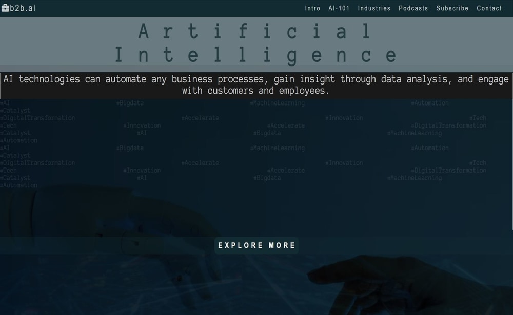

* The Intro Section is the first encounter once the user land to the site. The intro has a brief heading and also features typewriter animation to make this site look tech-savvy.   
[Live Feature Here](https://cgauci87.github.io/ci-portfolio-one-b2b.ai/index.html)

### Navigation Menu

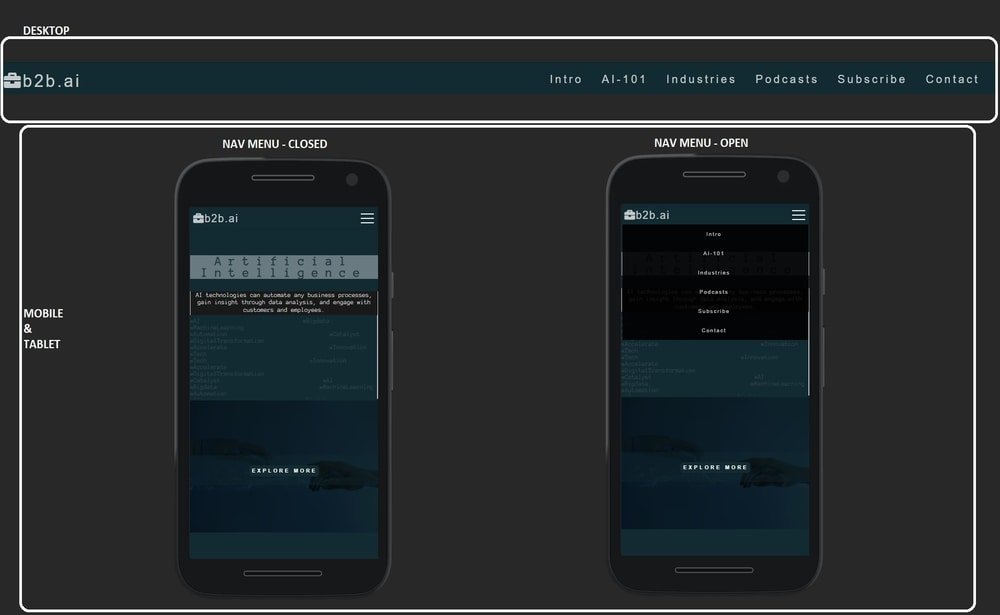
* At the top of the website, a fixed navigation menu is displayed on desktop and large displays. The navbar is fully responsive in smaller devices and user will find a toogle on top right side to open the menu.
 In this navigation menu users can navigate to all sections while the b2b.ai logo on the left side is clickable and users can refer to it when they need to go back to #intro 
[Live Feature Here](https://cgauci87.github.io/ci-portfolio-one-b2b.ai/index.html)

### AI-101 Section

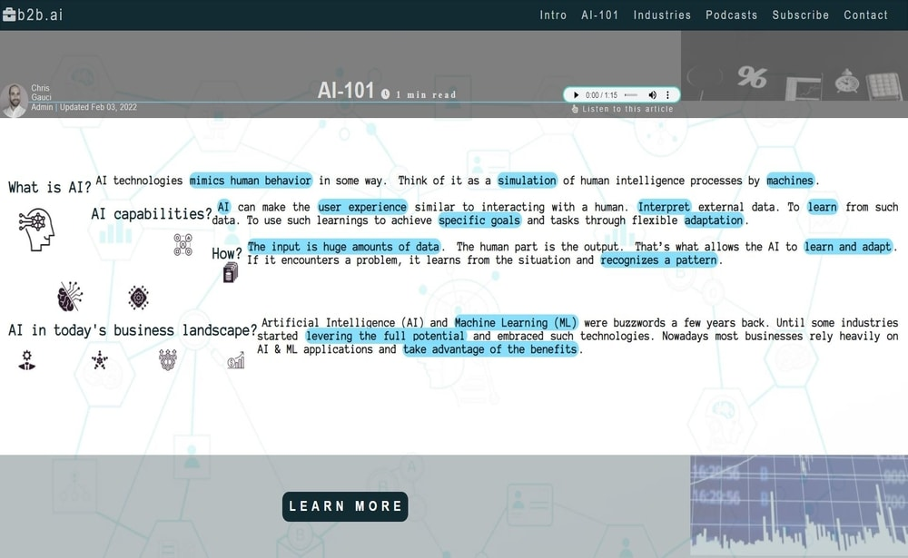

* AI-101 section is an educational resource where users can get insightful information about artificial intelligence technologies being used in the business world.  
[Live Feature Here](https://cgauci87.github.io/ci-portfolio-one-b2b.ai/index.html?#ai-101)

### Industries Section

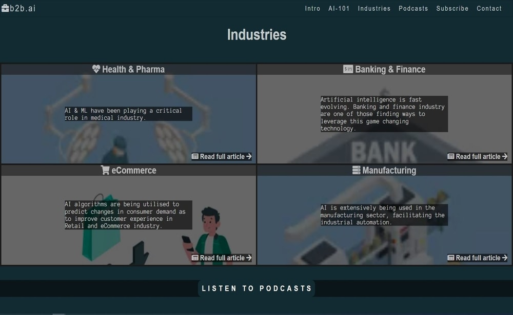

* This section showcase four industries which use artificial intelligence solutions as part of their business operations. Once user clicks on "Read full article"; a pop-up will be invoked and an article of the chosen industry will open.  
[Live Feature Here](https://cgauci87.github.io/ci-portfolio-one-b2b.ai/index.html?#industries)

### Podcasts Section

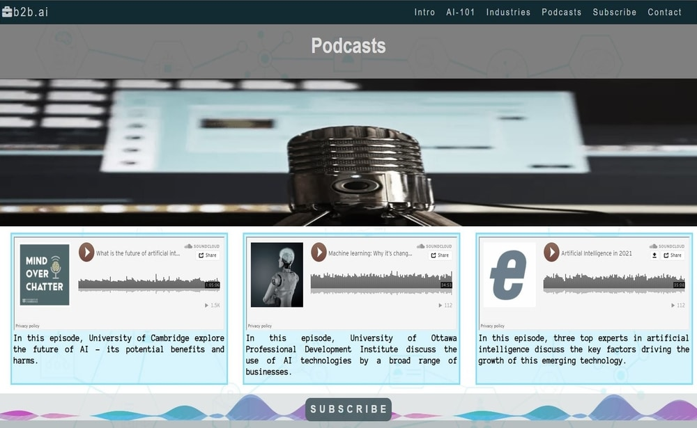

* Podcasts section features a playlist where user can listen to AI-related podcasts.  
[Live Feature Here](https://cgauci87.github.io/ci-portfolio-one-b2b.ai/index.html?#podcasts)

### Subscribe Section

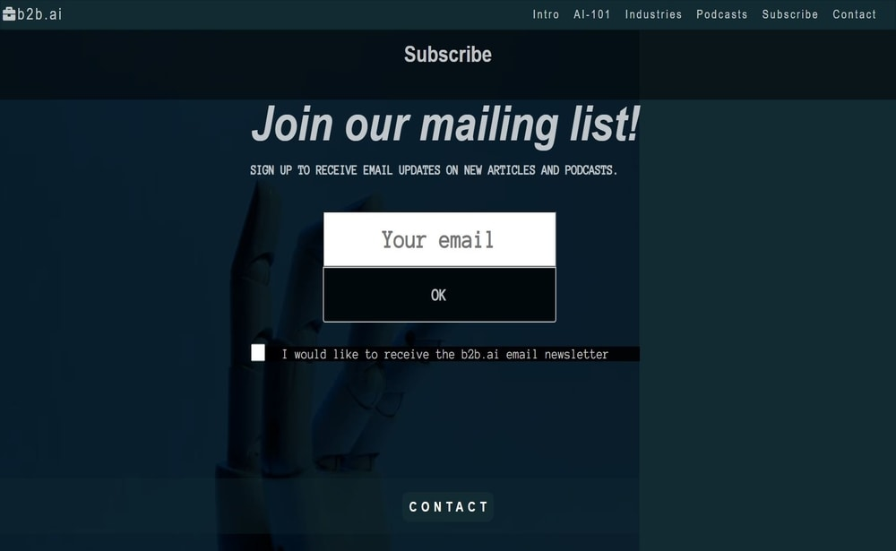

* This section has a form where user can sign up to receive email updates on new articles and podcasts.  
[Live Feature Here](https://cgauci87.github.io/ci-portfolio-one-b2b.ai/index.html?#subscribe)

### Contact Section

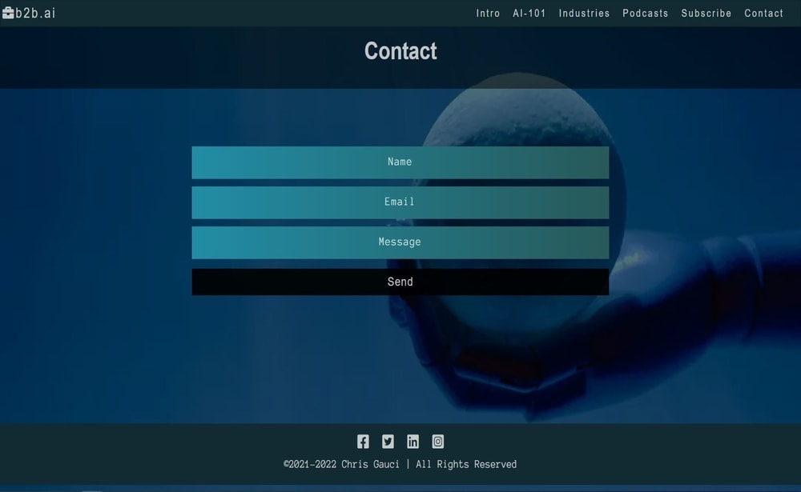

* Users can reach b2b.ai by inputting their Name, email address and write their feedback or query through the form provided in this section.  
[Live Feature Here](https://cgauci87.github.io/ci-portfolio-one-b2b.ai/index.html?#contact)

### Footer

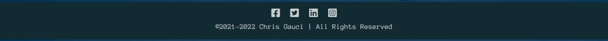

* The footer is positioned at the bottom part of the contact section. It contains social media links where user can learn more about b2b.ai company. At the foot of the page, user can find the copyright message.  
[Live Feature Here](https://cgauci87.github.io/ci-portfolio-one-b2b.ai/index.html?#contact)

### Submitted Form Page

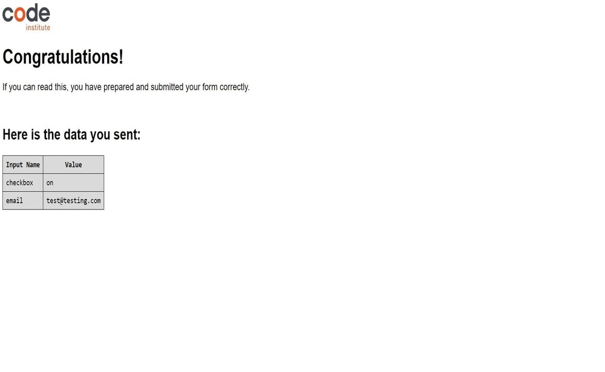

* Once the user successfully complete and submit a subscribe form or contact form, they will land on the submission form page as per above example. 

## Future Features
  
### Search Bar

* Add a Search Bar in the navigation menu. This would allow users to searh using keywords related to the site content.

### Dark/Light Mode Theme Toggle

* Add a toggle so users may be able to switch theme in Dark or Light mode to view content according to their preference.

## Technologies Used

### Languages Used 

* [HTML5](https://en.wikipedia.org/wiki/HTML5).
* [CSS3](https://en.wikipedia.org/wiki/Cascading_Style_Sheets).

### Frameworks - Libraries - Programs Used

* [Google Fonts:](https://fonts.google.com/)
   * Google fonts were used to import the 'Poppins' and 'El Messiri' fonts throughout the style.css.
* [Font Awesome:](https://fontawesome.com/)
    * Font Awesome are used as an icons for user UX purposes.
* [Git](https://git-scm.com/)
    * Git was used for version control by utilizing the Gitpod terminal to commit to Git and Push to GitHub.
* [GitHub:](https://github.com/)
    * GitHub is used to store the project's code after being pushed from Git.
* [PIXLR:](https://pixlr.com/)
    * PIXLR was used to create, modify and resize all images on this website.
  
## Testing

The W3C Markup Validator and W3C CSS Validator Services were used to validate every page of the project to ensure there were no syntax errors in the project.

* [W3C Markup Validator](https://validator.w3.org/#validate_by_uri) - [Website Results](https://validator.w3.org/nu/?doc=https%3A%2F%2Fcgauci87.github.io%2Fci-portfolio-one-b2b.ai%2F)
* [W3C CSS Validator](https://jigsaw.w3.org/css-validator/#validate_by_uri) - [Website Results](https://jigsaw.w3.org/css-validator/validator?uri=https%3A%2F%2Fcgauci87.github.io%2Fci-portfolio-one-b2b.ai%2F&profile=css3svg&usermedium=all&warning=1&vextwarning=&lang=en)

Google Lighthouse was used to test Performance, Best Practices, Accessibility and SEO on both Desktop and Mobile devices.

The testing was done using the Google Chrome Browser. Chrome Developer Tools was used extensively, particularly to check responsiveness on different screen sizes. Testing was also done using Firefox on desktop, and again on Google Chrome and Opera on the OnePlus 6T.

* Responsive on all device sizes between 280px - 2600px wide

* Devices tested using the Google Developer Tools emulator

    * Apple iPad Mini (468px x 4024)
    * Apple iPhone 4 (320px x 480px)
    * Apple iPhone 5/S (320px 568px)
    * Apple iPhone 6/7/8 (375px x 667px)
    * Apple iPhone 6/7/8 Plus (414px x 736px)
    * Apple iPhone X (375px x 812px)
	* BlackBerry Z30 (360px x 640px)  
    * BlackBerry PlayBook (600px x 1024px)  
    * Samsung Galaxy Note 3 (360px x 640px) 
    * Samsung Galaxy S3 (360px x 640px)   
    * Samsung Galaxy S9+(320px x 658px) 
    * LG Optimus L70 (384px x 640px)
    * Microsoft Lumia 550 (640px x 360px) 
    * Microsoft Lumia 950 (360px x 640px) 
    * Nexus 4 (384px x 640px) 
    * Nokia Lumia 520 (320px x 533px) 
    * Nokia N9 (480px x 854px) 
    * Pixel 3 (393px x 786px)

* Desktop Results:

  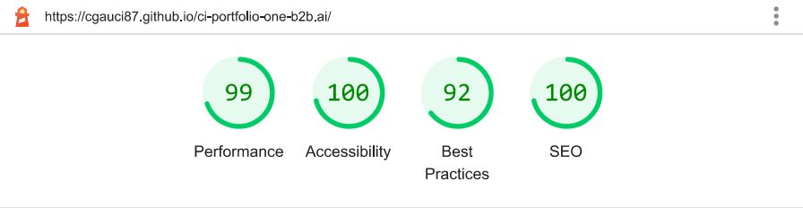

* Mobile Results:

  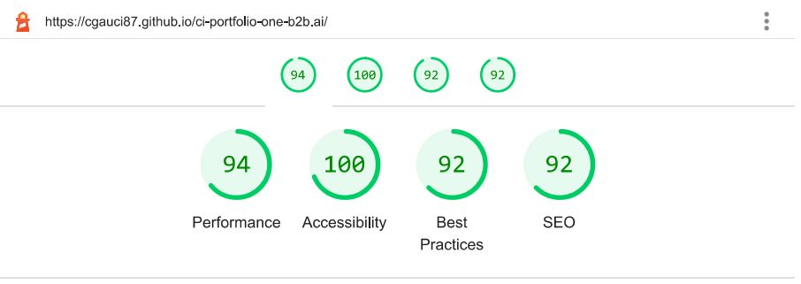

   ## Functionality
* All links have been hovered and clicked to ensure accessibility.
* Pages all load correctly on all device screen sizes.
* All social media links work correctly and open on a new tab.
* All images load on each section as intended.
* All the buttons are working correctly and bring the users to the function that they were built for.
* The buttons in all sections change the background and/or text color when hovered by the user.

   ## Bugs

* Initially, I was unable to produce the ideal responsive design of the forms in Subscribe and Contact sections. The bug has since been fixed permanently by using more relative units.

   ## Website Development Issues

* At the start of this project, I was not familiar with git commands and therefore I was unsure if I had used the commands correctly in my initial commits. Following a call with my mentor, he guided me to use the right procedures.

## Deployment of This Project

The website development was created in the "main" branch. This branch was deployed using GitHub Pages.

* This site was deployed by completing the following steps:

1. Open [GitHub](https://github.com/).
2. Click on the project to be deployed.
3. Navigate to the "Settings".
4. Navigate down to the "GitHub Pages".
5. Click on "Check it out here!".
6. Select the "main" branch and select "Save".
7. The link to the live website was ready on the top.

## Forking This Project

* Fork this project following the steps:

1. Open [GitHub](https://github.com/).
2. Click on the project to be forked.
3. Find the 'Fork' button to the top right of the page.
4. Once you click the button the fork will be in your repository..

## Cloning This Project

* Clone this project following the steps:

1. Open [GitHub](https://github.com/).
2. Click on the project to be cloned.
3. You will be provided with three options to choose from, HTTPS, SSH or GitHub CLI, click the clipboard icon in order to copy the URL.
4. Once you click the button the fork will be in your repository.
5. Open a new terminal.
6. Change the current working directory to the location that you want the cloned directory.
7. Type 'git clone' and paste the URL copied in step 3.
8. Press 'Enter' and the project is cloned.

## Credits

### Information Sources/Resources

* [W3Schools](https://www.w3schools.com/)

* [Stack Overflow](https://stackoverflow.com/)

* [CSS-Tricks](https://css-tricks.com/)
  

## Content

* The quotes in the articles are from:
 [medium.com](https://medium.com/bytehealth-ai/applications-of-ai-in-healthcare-industry-79366661714e), [sciencedaily.com](https://www.sciencedaily.com/releases/2016/08/160829122106.htm), [mayoclinic.org](https://www.mayoclinic.org/tests-procedures/robotic-surgery/about/pac-20394974), [forbes.com](https://www.forbes.com/sites/louiscolumbus/2020/10/31/the-state-of-ai-adoption-in-financial-services/?sh=4d0a74822aac), [globenewswire.com](https://www.globenewswire.com/news-release/2015/09/28/771442/31614/en/Study-Finds-Sales-and-Marketing-Wasting-50-of-Time-and-Money-on-Leads.html), [deloitte.com](https://www2.deloitte.com/cn/en/pages/consumer-industrial-products/articles/ai-manufacturing-application-survey.html).

### Images

* All images were offered by [Pexels.com](https://www.pexels.com/).

### Audio

* The audio was processed by Chrome Screen reader extension [chrome.google.com](https://chrome.google.com/webstore/category/extensions).
* Podcasts source is [soundcloud.com](https://soundcloud.com/).

### Icons

* All the icons were provided and used under the Fontawesome License [Fontawesome.com](https://fontawesome.com/license/free).

### Animation

* Typewriter animation inspired by [geeksforgeeks.org](https://www.geeksforgeeks.org/how-to-create-typewriter-animation-using-html-and-css/).

### Form

* Submitted form page has been sourced from [codeinstitute.net](https://codeinstitute.net/).
  
## Special Thanks

 * Special thanks to my mentor Brian O'Hare and my fellow students at Code Institute for their assistance throughout this project.
